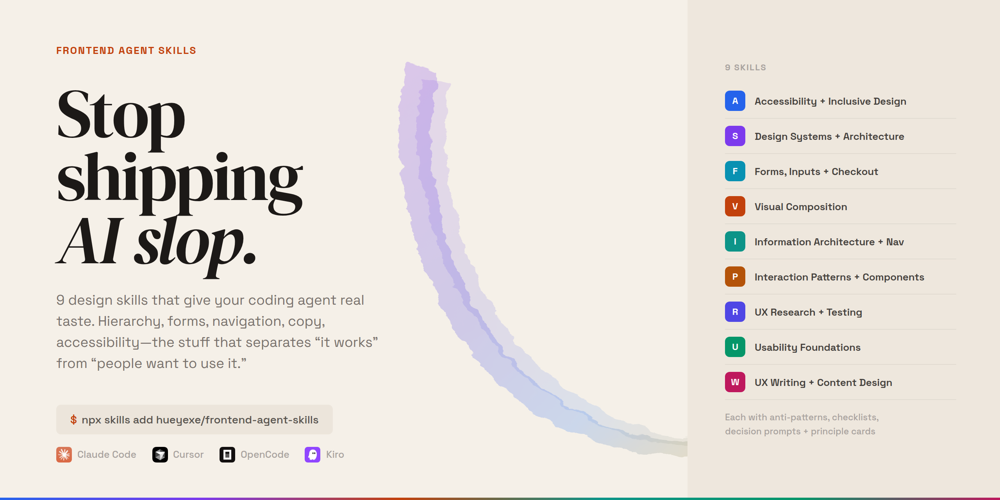

<p align="center">
  
</p>

# Frontend Agent Skills

You know the look. Gradient blob hero. Perfectly symmetrical 3-column grid. A "Get Started" button floating in space with no visual weight. Technically correct. Completely forgettable.

AI agents are fast but tasteless. They scaffold a full page in seconds and make every decision with the confidence of someone who has never actually used the thing they're building.

These 9 skills fix that. They inject real design thinking into your agent's workflow so the output stops looking like it was assembled from a template.

## The problem, side by side

| | Without skills | With skills |
|---|---|---|
| **Forms** | Dumps every field on one page, no grouping, inline validation that fires on first keystroke | Groups related fields, progressive disclosure, validates on blur, explains errors in plain language |
| **Navigation** | Flat list of every page in a hamburger menu | Hierarchy based on user tasks, clear wayfinding, breadcrumbs where depth demands it |
| **Error states** | `Something went wrong.` | `We couldn't save your changes because the file is too large. Try one under 10MB.` |
| **Visual hierarchy** | Everything the same size and weight. Important actions buried. | Primary action is obvious. Secondary content recedes. Your eye knows where to go. |
| **Accessibility** | `alt=""` on every image, calls it done | Keyboard flows, focus management, semantic structure, screen reader announcements, resilient across zoom and user settings |

The difference isn't subtle. It's the difference between a user finishing the task and a user closing the tab.

## Install

```bash
npx skills@latest add hueyexe/frontend-agent-skills
```

Works with Claude Code, Cursor, OpenCode, Kiro, and anything that supports the [skills](https://github.com/skills-coop/skills) format.

Install all 9, or pick what you need:

```bash
npx skills@latest add hueyexe/frontend-agent-skills --skill ui-visual-composition
```

## The 9 skills

### ♿ [accessibility-inclusive-design](./accessibility-inclusive-design)

Not the "add alt text and call it done" version. Keyboard flows, screen reader awareness, semantic structure, resilient layouts, readable content, inclusive defaults. The kind of accessibility that works across devices and abilities without feeling bolted on.

### 🧱 [design-systems-frontend-architecture](./design-systems-frontend-architecture)

Turns isolated screens into reusable systems. Design tokens, component contracts, responsive layouts, semantic markup, CSS strategy, documentation, governance. For when you need the agent to think in systems instead of one-off pages.

### 📝 [forms-inputs-checkout](./forms-inputs-checkout)

Forms are where users go to suffer. This skill reduces that suffering. Validation, error states, field grouping, progressive disclosure, checkout flows, registration, payment, onboarding. The details that make people actually finish filling things out.

### 🧭 [information-architecture-navigation](./information-architecture-navigation)

Navigation, labels, taxonomy, hierarchy, search, metadata, content grouping, wayfinding. For products where users need to find, compare, and act on structured information without getting lost three clicks in.

### 🎛️ [interaction-patterns-components](./interaction-patterns-components)

Pattern selection, component behavior, flow design, state management for web, mobile, SaaS, dashboards, design systems. Helps the agent pick the right pattern for the job instead of defaulting to a modal for everything.

### 🎨 [ui-visual-composition](./ui-visual-composition)

Hierarchy, spacing, typography, color, depth, imagery, visual states. The difference between a layout that looks "fine" and one that actually communicates. The visual decisions that make interfaces clear and attractive without over-designing.

### 🔬 [ux-research-discovery-testing](./ux-research-discovery-testing)

Lightweight research planning, discovery interviews, usability tests, synthesis, evidence-backed recommendations. For when you want the agent to help you learn something about your users instead of just assuming.

### 🧩 [ux-usability-foundations](./ux-usability-foundations)

The fundamentals. Affordances, feedback, constraints, error prevention, recognition over recall, navigation clarity, task flow. The baseline usability every interface needs before you start debating border radius values.

### ✏️ [ux-writing-content-design](./ux-writing-content-design)

Microcopy, labels, CTAs, empty states, onboarding, errors, success messages, notifications, voice, tone. Makes product interfaces clearer, more trustworthy, and easier to recover from. Because `Something went wrong` is not a helpful error message.

## What's inside each skill

```
accessibility-inclusive-design/
├── SKILL.md                          # Decision frameworks and operational rules
└── references/
    ├── anti-patterns.md              # Common mistakes and how to fix them
    ├── checklists.md                 # Quality gates to verify against
    ├── decision-prompts.md           # Questions the agent asks before choosing
    └── principle-cards.md            # Core principles as reusable agent behavior
```

Every skill follows this structure. The SKILL.md is the main brain. The references folder is the backup: patterns to avoid, things to check, questions to ask, principles to follow.

The agent doesn't just get instructions. It gets a framework for making design decisions that hold up when real users show up.

## License

MIT
